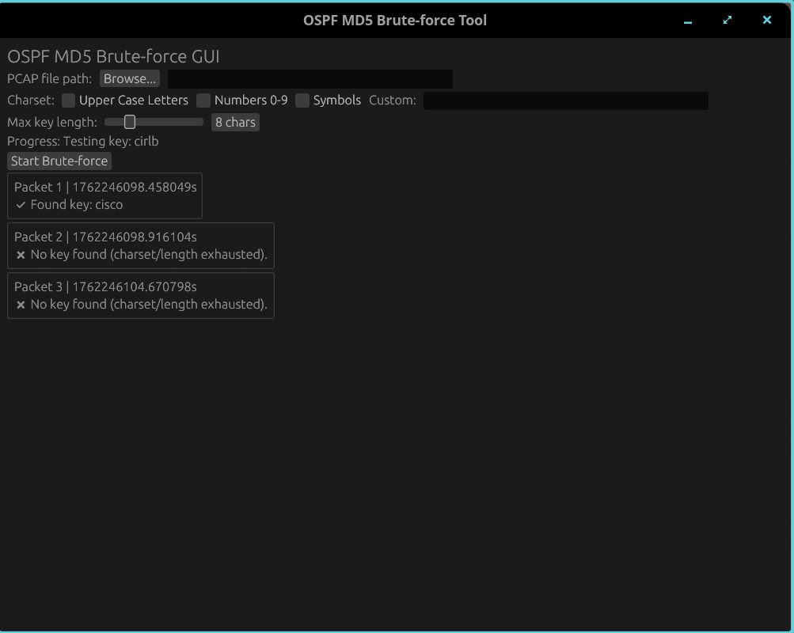

# Cisco OSPF MD5 Cracker



A Rust-based brute-force tool that extracts OSPF packets from `.pcap` or `.pcapng` files and attempts to recover Cisco OSPF MD5 authentication keys.

This project performs offline cracking only. It reads captured OSPF traffic, reconstructs the MD5 authentication material, and brute-forces possible keys based on a configurable character set and maximum key length.

## Features

* Accepts `.pcap` and `.pcapng` packet capture files.
* Automatically extracts OSPF packets that contain MD5 authentication.
* Brute-forces MD5 authentication keys using configurable character sets.
* Parallelized search for faster cracking.

## How It Works

1. You provide a capture file containing OSPF traffic with MD5 authentication enabled.
2. The tool parses the capture and extracts relevant OSPF packets.
3. For each packet, it reconstructs the MD5 input structure.
4. The brute-force engine iterates through candidate keys until a match is found.

## Installation

```bash
git clone https://github.com/fuchskurt/cisco_ospf_md5_cracker
cd cisco_ospf_md5_cracker
cargo build --release
```

The resulting binary will be located at:

```
target/release/crack_tool_cisco_ospf_md5
```

If a key is found, it will be printed and the process will immediately terminate.

## Notes & Limitations

* Cracking time depends heavily on key length and character set size.
* Only use this tool on systems and captures you are authorized to test.
* The tool does not perform any network interaction; it is entirely offline.

## License

This project is licensed under the GPL-3.0 license.
